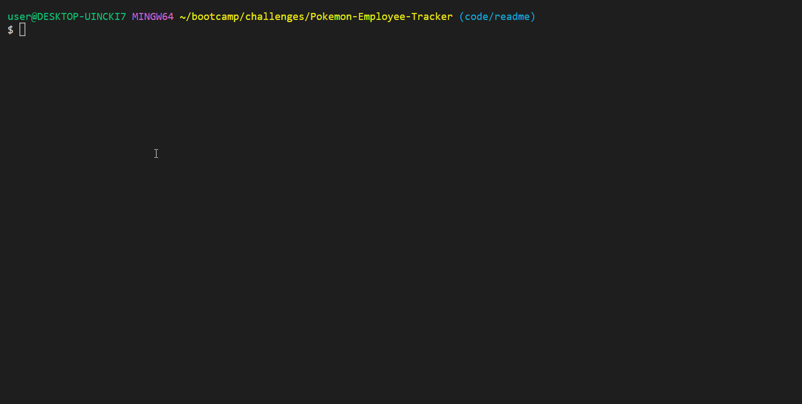

# Pokemon Elite Four Tracker

  

-----------------------

## Technology Used 🖥️

| Technology Used         | Resource URL           | 
| ------------- |:-------------:| 
| JavaScript | [https://developer.mozilla.org/en-US/docs/Web/JavaScript](https://developer.mozilla.org/en-US/docs/Web/JavaScript)     |  
| Inquirer | [https://github.com/SBoudrias/Inquirer.js/](https://github.com/SBoudrias/Inquirer.js/)     |   
| node.js | [https://nodejs.org/en](https://nodejs.org/en)     |     
| Git | [https://git-scm.com/](https://git-scm.com/)     |   

--------------------

## Description 📝

The Elite Four, the strongest trainers in their region. They climbed through the rankings and collected all of the gym badges just to stand at the very top.

And now you can search through all of their pokemon in one place!

Quickly and easily find out which ones are the strongest in their party so you can plan around how to fight each and every Elite Four member. Without preparation and through a lot of full revives, it'd be rough for any trainer to beat the strongest of them all. (Starting off, the database only seeds with information about the Elite Four from Kanto, Hoenn, and Sinnoh since those are my favorite games)

Through the usage of MySQL databases and Inquirer, this application is able to take in user input and perform various different functions such as: viewing a region's Elite Four pokemon, viewing a specific trainer's pokemon, and even adding in new regions, trainers, or pokemon yourself.

-----------------------

## Table of Contents 📋
* [Installation Instructions](#installation-instructions-📥)
* [Usage Information](#usage-information-✅)
* [Author Info](#author-info-👺)
* [Questions?](#questions-❓)
* [License](#license-🚩)

----------------------

## Installation Instructions 📥

To install this application, follow the steps outlined below:

1. Download or clone this repo to your local machine
2. Open the root folder for this repo
3. Open a terminal or CLI in the root folder
4. Run `npm i` or `npm install` to install all dependencies (make sure you have node.js installed as well on your local machine)
5. refer to [usage instructions](#usage-information-✅) on how to use the application

------------------------

## Usage Information ✅

1. In your terminal run the `schema.sql` file through the MySQL CLI 
2. Then run the `eggs.sql` file through the MySQL CLI
3. In the `index.js` file update your `user` and `password` in lines 9 and 10, respectively, with the ones correlating with your MySQL information
4. Run `node index.js` to start
5. Choose which option you'd like and follow the prompts
6. If an error occurs, please make sure to read the message and update your answers accordingly

You can also [watch this demo video to see how every function works](https://youtu.be/YFUhG4-oqb0)

If there are any questions on how to use the app, feel free to checkout my [socials](#author-info-👺) down below and message me there.

------------------------

## Author Info 👺

### ***daevidvo***
* [Github](https://www.github.com/daevidvo)
* [LinkedIn](https://www.linkedin.com/in/daevidvo)
* [Instagram](https://www.instagram.com/daevidvo)

--------------------------

## Questions ❓

Email me at: [daevidvo@gmail.com](mailto:daevidvo@gmail.com)

------------------------

## License 🚩

https://opensource.org/licenses/MIT

The MIT License (MIT)
=====================

Copyright © daevidvo

Permission is hereby granted, free of charge, to any person
obtaining a copy of this software and associated documentation
files (the “Software”), to deal in the Software without
restriction, including without limitation the rights to use,
copy, modify, merge, publish, distribute, sublicense, and/or sell
copies of the Software, and to permit persons to whom the
Software is furnished to do so, subject to the following
conditions:

The above copyright notice and this permission notice shall be
included in all copies or substantial portions of the Software.

THE SOFTWARE IS PROVIDED “AS IS”, WITHOUT WARRANTY OF ANY KIND,
EXPRESS OR IMPLIED, INCLUDING BUT NOT LIMITED TO THE WARRANTIES
OF MERCHANTABILITY, FITNESS FOR A PARTICULAR PURPOSE AND
NONINFRINGEMENT. IN NO EVENT SHALL THE AUTHORS OR COPYRIGHT
HOLDERS BE LIABLE FOR ANY CLAIM, DAMAGES OR OTHER LIABILITY,
WHETHER IN AN ACTION OF CONTRACT, TORT OR OTHERWISE, ARISING
FROM, OUT OF OR IN CONNECTION WITH THE SOFTWARE OR THE USE OR
OTHER DEALINGS IN THE SOFTWARE.
